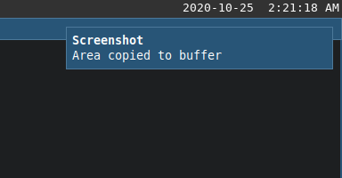
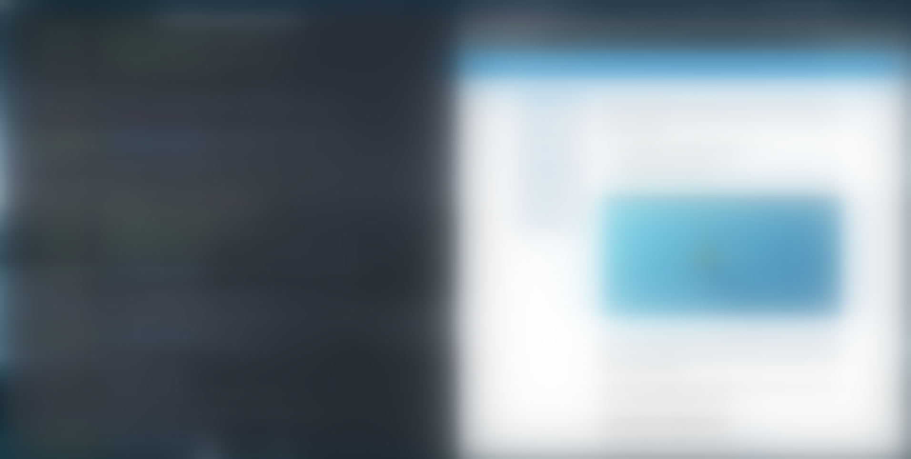
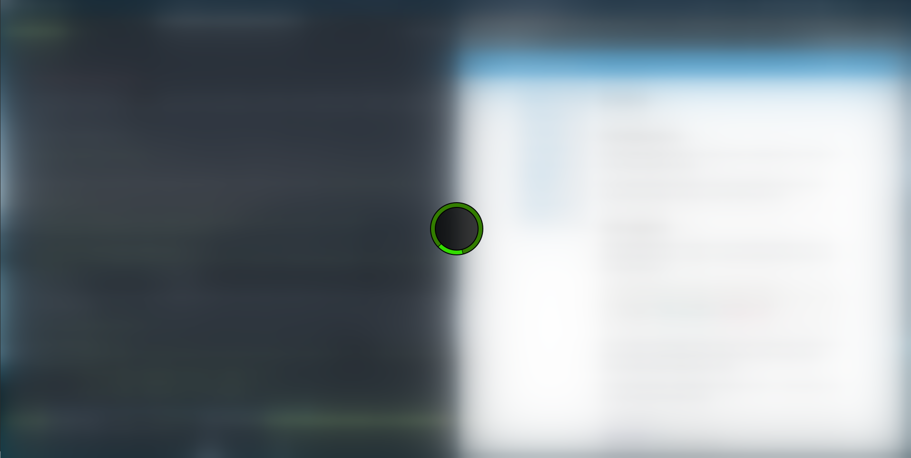
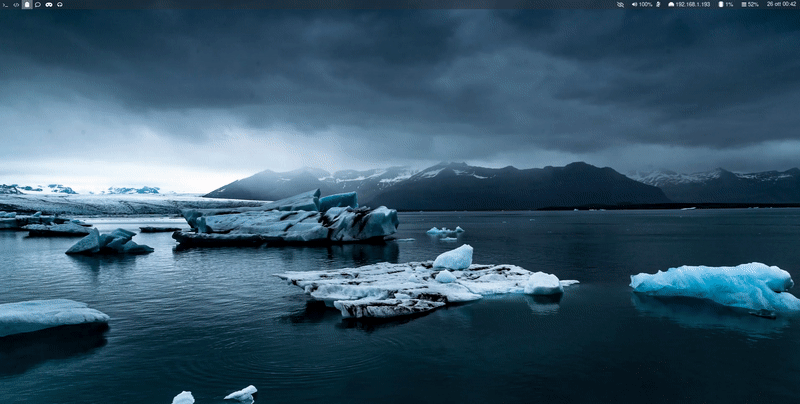

# Extra

---

## Introduction

In this Extra section I will be showing some configurations or things to do that you might find useful.

For example the first thing that I found missing that I required was having the ssh-agent running so we will start with that!

---

## ssh-agent

The problem was that ssh-agent is not running by default so you can add these lines to your `.bashrc` to start an instance and reuse it for the whole session:
```
# start only one ssh-agent and reuse the created one
# this is used for sway, althou keys added do not persist on reboot
if ! pgrep -u "$USER" ssh-agent > /dev/null; then
    ssh-agent > "$XDG_RUNTIME_DIR/ssh-agent.env"
fi
```

This will ask for password on first use, so if you reboot you will have to insert it again. If you prefer that it remembers it you could explore solutions with gnome keyring or similiar.

To complement this, I added these settings to the `~/.ssh/config` file so I have my key already added:
```
# ~/.ssh/config

AddKeysToAgent yes
IdentityFile ~/.ssh/my_private_key
```

---

## Screenshots

This is actually a feature that I could not live without as I find myself sharing often screenshots for work, so it was one of the first things that I setup to mimic my Ubuntu experience.

The dependencies that you will need to install are:

* [wl-clipboard](https://github.com/bugaevc/wl-clipboard)
* [grim](https://github.com/emersion/grim)
* [slurp](https://github.com/emersion/slurp)
* [jq](https://stedolan.github.io/jq/)

**grim** allows you to grab images, **slurp** allows you to select a region of the screen.

**wl-clipboard** gives you utilities for working with the clipboard like `wl-copy` and **jq** is a json parser, these two are dependencies of a script that we will use for simpler screenshotting: [grimshot](https://github.com/swaywm/sway/blob/master/contrib/grimshot)

Install all of these with apt and make sure to have the grimshot script executable:
```
sudo apt install wl-clipboard
sudo apt install grim
sudo apt install slurp
sudo apt install jq
```

I have modified this line to have better naming of the saved screenshots:

```sh
# before:
2020-09-15T02:06:18,876888351+02:00.png

# after:
2020-09-18-03:12:24.png
```
```
# line 31
FILE=${3:-$(getTargetDirectory)/$(date +"%Y-%m-%d-%H:%M:%S").png}
```

---

All that's left is adding these commands to the sway config `~/.config/sway/config`.

Here I have **grimshot** as an executable under `~/.local/bin/grimshot`
```
# Screenshots
# currently having a custom grimshot under .local/bin
set $grimshot ~/.local/bin/grimshot

bindsym Print exec $grimshot --notify save screen
bindsym Shift+Print exec $grimshot --notify copy screen
bindsym Ctrl+Print exec $grimshot --notify save area
bindsym Ctrl+Shift+Print exec $grimshot --notify copy area
```

And you are set! With these settings you will have:

* `Print` - saves the entire screen
* `<Shift> + Print` - copy the entire screen
* `<Ctrl> + Print` - select an area and save it
* `<Shift>+<Ctrl> + Print` - select an area and copy it

You will find the saved screenshot in your `~/Pictures` folder.

If you require more control, for example you need to be able to screenshot only a specific window, feel free to add more commands!

---

You probably noticed the `--notify` flag that I have set, it will send a notification but if you followed along you probably aren't seeing any. In the next section we will look into installing a notification manager!

---

## Notification Manager (mako)

If you try to send a notification via command line you will see that nothing appears:
```
notify-send hello
```

---

**Install**

To manage notifications you can install [mako](https://github.com/emersion/mako) via apt:
```
sudo apt install mako-notifier
```


Mako can be started by executing the program `mako`, now if you try to send a notification again you will see it appear by default in the top right of the screen: `notify-send hello`


You probably noticed that the notification won't disappear because we didn't specify a timeout but don't worry for now.

---

**Config**

Instead of starting mako manually it would be nice if sway executed it at startup and it would also be nice to have some commands to dismiss the notifications.

Add these lines to your sway config:
```
# Mako
bindsym $mod+n exec makoctl dismiss
bindsym $mod+Shift+n exec makoctl dismiss -a

# Start programs
exec mako
```

With these lines you will have mako running by sway on startup and the following bindings:

* `<mod>+n` - dismiss the last notification
* `<mod>+<shift>+n` - dismiss all notifications

---

You can also configure mako, a simple config to use could be:
```
# ~/.config/mako/config

default-timeout=5000

[urgency=high]
ignore-timeout=1
```

It is self explanatory, every notification has a default life of 5 seconds except notifications marked with urgency high, those will ignore the configured timeout.
You can lookup more settings and customize it further!

If you try to take a screenshot now, you will see the notification for it appear!


---

**Troubleshooting**

On ubuntu 20.04 there might a problem with apparmor and mako so if you see a strange error on opening the configuration file for mako you can disable apparmor for it with:
```
sudo apt install apparmor-utils
sudo aa-disable /etc/apparmor.d/fr.emersion.Mako
```

---

## Blurred Lock Screen

Instead of having a black lock screen I used a script with grim and ffmpeg to take a screenshot and blur it. This might be something totally not functional that you might enjoy.

Install ffmpeg with:
```
sudo apt install ffmpeg
```

Then create a script with these contents, I named the script `create_lock_image`:
```
#! /bin/sh

# Take a screenshot of the desktop and apply a gaussian blur to create
# an image to use for the lock screen.

grim /tmp/_sway_lock_image.png
ffmpeg -i /tmp/_sway_lock_image.png -filter_complex "gblur=sigma=50" /tmp/sway_lock_image.png -y
```

Then you can configure your lock screen to run the script and set the resulting image as background:
```
# ~/.config/sway/config

exec swayidle -w \
         timeout 300 '~/.local/bin/create_lock_image && swaylock -f -i /tmp/sway_lock_image.png' \
         timeout 600 'swaymsg "output * dpms off"' \
              resume 'swaymsg "output * dpms on"' \
         before-sleep 'swaylock -f -c 000000'
```

The result will be something like this depending on your screen


and while unlocking:



---

## Fzf as application launcher

[Fzf](https://github.com/junegunn/fzf) is a wonderful tool, it's a fuzzy finder and can be used as an application launcher.

Install fzf with:
```
sudo apt install fzf
```

Add the following lines to your sway config:
```
# Application launcher with fzf
set $menu exec $term --class=launcher -e bash -c 'compgen -c | grep -v fzf | sort -u | fzf --layout=reverse | xargs -r swaymsg -t command exec'

# Windows config
for_window [app_id="^launcher$"] floating enable, border none, opacity 0.8
```

This will use a terminal with fzf for launching programs in floating mode without border and a little transparent, you can invoke it with the same command as before `<mod>+d`


