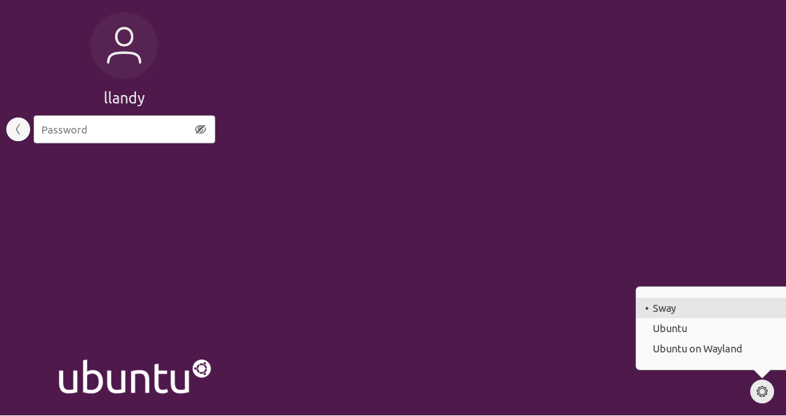

# Simple Install

Install wlroots and sway from source.

## Intro

In this section we are going to build [wlroots](https://github.com/swaywm/wlroots) (required to build sway) and [sway](https://github.com/swaywm/sway) from the source repository. We will be bulding the master version of both, but if you prefer you can checkout a stable release ex. 1.5

I will be building the master version because sway is in active development and it's possible that a bug you might experience is fixed in the latest commit.

## Build wlroots

Here we will be building and installing wlroots.

### Dependencies

Start by installing the essentials tools, we will be using pip to install an updated version of meson.

```
sudo apt install build-essential
sudo apt install git
sudo apt install python3-pip
```

---

**Meson**

wlroots requires a more up to date version of [meson](https://mesonbuild.com/) from what ubuntu provides, we will be using pip to install an updated one.

```sh
pip3 install --user meson
```

We now need this to be available under PATH:
```
export PATH=$HOME/.local/bin:$PATH
```

You can either:

* use the command in the shell you will be inputting the commands
* add the line at the end of your `.bashrc`

---

Next are direct dependencies of wlroots:
```
sudo apt install wayland-protocols \
libwayland-dev \
libegl1-mesa-dev \
libgles2-mesa-dev \
libdrm-dev \
libgbm-dev \
libinput-dev \
libxkbcommon-dev \
libgudev-1.0-dev \
libpixman-1-dev \
libsystemd-dev \
cmake \
libpng-dev \
libavutil-dev \
libavcodec-dev \
libavformat-dev \
ninja-build \
meson
```

The next ones are optional dependencies for x11 support, not required if you want a full wayland installation.

If you don't know exactly why you don't need them, I highly encourage you to install them:
```
sudo apt install libxcb-composite0-dev \
        libxcb-icccm4-dev \
        libxcb-image0-dev \
        libxcb-render0-dev \
        libxcb-xfixes0-dev \
        libxkbcommon-dev \
        libxcb-xinput-dev \
        libx11-xcb-dev
```

### Build & Install

Now we will be cloning, building and installing wlroots.

**Clone the repo**

You can choose the path you prefer for the following steps, I will be working in `~/sway-build`.
```
mkdir ~/sway-build
cd ~/sway-build
git clone https://github.com/swaywm/wlroots.git
cd wlroots
```

**Build wlroots**
```sh
# ~/sway-build/wlroots
meson build
ninja -C build
```

**Install wlroots**
```sh
# ~/sway-build/wlroots
sudo ninja -C build install
```

And that's it, with this you have successfully installed wlroots.

## Build Sway

Here we will be building and installing Sway.

### Dependencies

The list of what we need now is smaller:
```
sudo apt install libjson-c-dev \
libpango1.0-dev \
libcairo2-dev \
libgdk-pixbuf2.0-dev \
scdoc
```

### Build & Install

Now we will be cloning, building and installing sway.

**Clone the repo**

We will be using the path created in the wlroots steps:
```
# ~/sway-build
git clone https://github.com/swaywm/sway.git
cd sway
```

**Build sway**
```sh
# ~/sway-build/sway
meson build
ninja -C build
```

**Install sway**
```sh
# ~/sway-build/sway
sudo ninja -C build install
```

That's it you just installed Sway! 🎉

## Sanity Checks & Post Install

### Desktop File

You should have this file `/usr/local/share/wayland-sessions/sway.desktop` with these contents:
```
[Desktop Entry]
Name=Sway
Comment=An i3-compatible Wayland compositor
Exec=sway
Type=Application
```

This file is what allows the login manager to select the environment Sway to start at login.

A neat trick is that you can **Exec** a custom script that sets some environment variables or does something else before starting sway, but we will see other ways to set these variables in further parts of the guide.

### Config File

You can copy the default sway config from `/usr/local/etc/sway/config` to `~/.config/sway/config`:
```
mkdir ~/.config/sway
cp /usr/local/etc/sway/config ~/.config/sway
```

This is the file you will be modifying to customize the sway behaviour and keybinds.

**note:** if you have an i3 config, you can copy that in the same path as above instead of the default one and it should work.

### Final dependencies

**Whaaat ?? More dependencies ???**

Bear with me, the default config expects some programs for some of its configuration, they can be changed but to make it work let's just install them and later we will see replacements.

The missing deps are:

* **dmenu**: default menu when using `<mod>+d`
* **swaybg**: allows sway to handle background images
* **swayidle**: allows sway to handle idle functionality
* **swaylock**: locks the screen
* **alacritty**: default terminal emulator in sway

You can install them with:
```
sudo apt install dmenu
sudo apt install swaybg
sudo apt install swayidle
sudo apt install swaylock
```

For alacritty, please see the [alacritty optional section below](#alacritty-optional) before trying sway.

---

**Idle behaviour**

You might want to uncomment this exec from the default config to have the idle behaviour you expect of screen locking and screen turn off:
```
### Idle configuration
#
# Example configuration:
#
# exec swayidle -w \
#          timeout 300 'swaylock -f -c 000000' \
#          timeout 600 'swaymsg "output * dpms off"' resume 'swaymsg "output * dpms on"' \
#          before-sleep 'swaylock -f -c 000000'
#
# This will lock your screen after 300 seconds of inactivity, then turn off
# your displays after another 300 seconds, and turn your screens back on when
# resumed. It will also lock your screen before your computer goes to sleep.
```

In a later section of the guide we will see how to have a custom behaviour to blur the screen on lock, a totally useless thing but definitely neat.

## Start Sway

Now we can finally start sway!

Logout and in the bottom right widget on login select Sway and proceed to login: 


You will be greeted by a pretty empty but clean virtual desktop:


To exit Sway you can press the keys `<mod>+shift+e` that will bring up a popup where you will have to click with the mouse to confirm:


Now you can experiment with Sway to see if it fits your workflow, with the default config you can use these commands to open a new terminal and close windows:

* `<mod>+enter` - Open a new terminal
* `<mod>+shift+q` - Close window
* `<mod>+d` - Open dmenu


Great! This concludes the simple install of Sway, if you are interested in some tools and configurations that I find useful for my day to day work, check the [Extra](extra.md) section!

I hope you will enjoy this new workflow as much as I do, and if you do not, you learned something new today!

## Alacritty (Optional)

The default terminal in the Sway config is [Alacritty](https://github.com/alacritty/alacritty).

### Install

To get an up to date version on Ubuntu you can use the following ppa:
```
sudo add-apt-repository ppa:mmstick76/alacritty
sudo apt update
sudo apt install alacritty
```

---

### Change default terminal

You don't have to use it and you can change the default by changing this line in the Sway config: 
```
# Your preferred terminal emulator
set $term alacritty
```

for example to use gnome-terminal:
```
# Your preferred terminal emulator
set $term gnome-terminal
```

---

### Why I use it

My personal reason for using alacritty is that I was looking for a minimal terminal to pair with Sway and it supports [vi keybinds](https://github.com/alacritty/alacritty/blob/master/docs/features.md#vi-mode).
